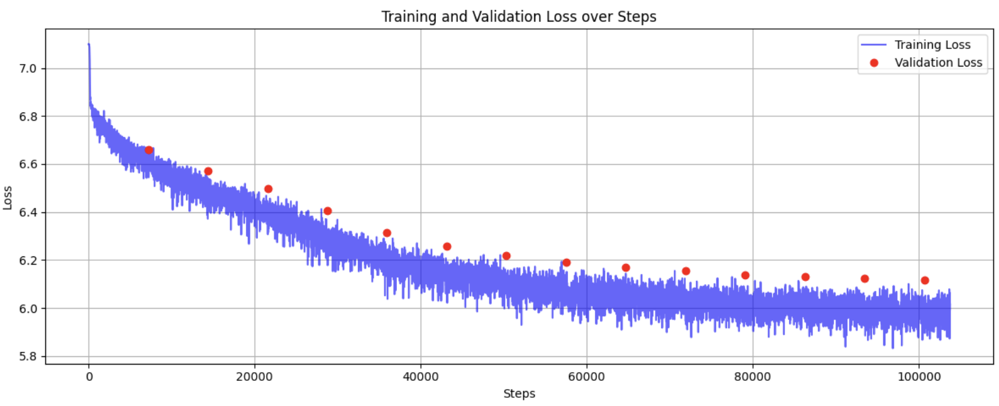
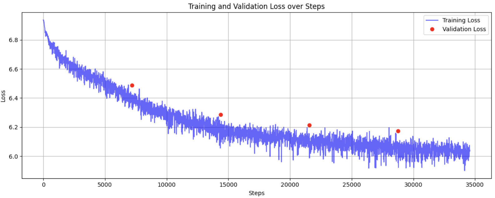
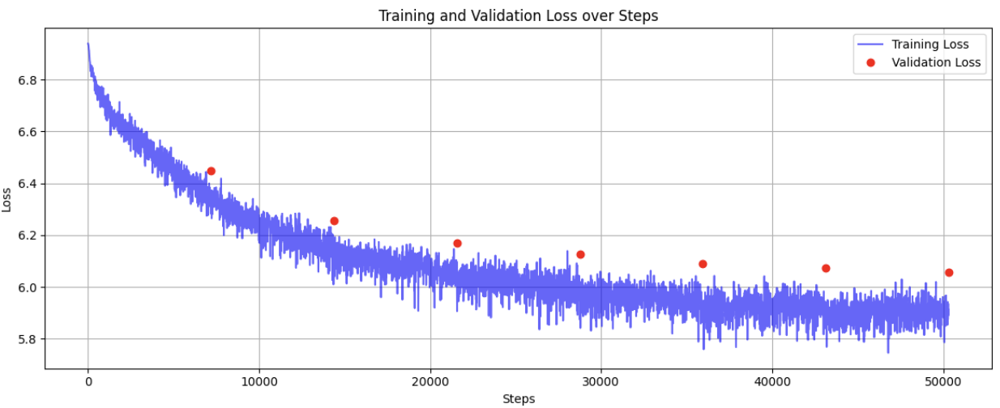

# AlexTTS - blog
*Author: Alex Chen*

## Motivation
I wanted to understand, at a low level, what an end-to-end deep learning project **really** means. While I've had some experience with autoregressive text generation models, it was primarily limited to fine-tuning pre-existing architectures. I had the privilege of speaking with [Eli](https://www.linkedin.com/in/elipugh), an ML researcher at [Cartesia](https://cartesia.ai/). Our conversation left me with a single, compelling thought:

> Why not build my own unique text-to-speech model?

*[Results](#sample-audio-clips) and [source code](https://github.com/Itisalex2/AlexTTS)*
## Terminology
- Text to speech (TTS): convert words to human speech
- Autoregressive: generate one token at a time, conditioning each output on previously generated tokens. Example: ChatGPT
- Grapheme-to-phoneme (G2P): conversion from text (graphemes) to pronunciation (phonemes)
- Speech tokenizer/codec: encode speech into compressed representations (tokens). Similar to text tokenizers but for speech instead. Output: sequence of discrete tokens
- Reference encoder: capture speaker-specific characteristics from speech samples. Output: speaker embedding 

## Architecture
TTS models are typically categorized into two types:
- Autoregressive (e.g. [BaseTTS](https://arxiv.org/pdf/2402.08093))
- Non-autoregressive (e.g. [StyleTTS 2](https://arxiv.org/pdf/2306.07691))

[Kokoro](https://huggingface.co/hexgrad/Kokoro-82M) is a non-autoregressive lightweight TTS model with 82 million parameters. It is based on [ISTFTNet](https://arxiv.org/pdf/2203.02395) and [StyleTTS2](https://arxiv.org/pdf/2306.07691), converting phonetic inputs into mel-spectrograms to synthesize speech in parallel. While it delivers great results, it is non-streamable due to its non-autoregressive nature. My goal was to leverage its G2P library, [Misaki](https://github.com/hexgrad/misaki), to generate audio tokens autoregressively. 

 High level Architecture. Note: I did not end up using a reference encoder.

Let's talk about my architecture in more detail!

### Data preprocessing
The dataset I used was [Gigaspeech](https://huggingface.co/datasets/speechcolab/gigaspeech). It contains audio and transcription data in English, and is easily downloadable in 5 sizes: XS, S, M, L, XL. I chose XS (10 hours) for debugging and S (250 hours) for the actual training. Here is a sample:
```json
{
    'segment_id': 'YOU0000000315_S0000660', 
    'speaker': 'N/A', 
    'text': "AS THEY'RE LEAVING <COMMA> CAN KASH PULL ZAHRA ASIDE REALLY QUICKLY <QUESTIONMARK>", 
    'audio': 
        {
            'path': '/home/user/.cache/huggingface/datasets/downloads/extracted/9d48cf31/xs_chunks_0000/YOU0000000315_S0000660.wav', 
            'array': array([0.0005188 , 0.00085449, 0.00012207, ..., 0.00125122, 0.00076294, 0.00036621], dtype=float32), 
            'sampling_rate': 16000
        }, 
    ...
}
```

My transformer implementation expects text and audio tokens. Let's prepare them. 

#### Text tokens
As mentioned earlier, I wanted to utilize [Kokoro's](https://huggingface.co/hexgrad/Kokoro-82M) [Misaki](https://github.com/hexgrad/misaki) G2P library. TTS models perform better by converting text to phonemes first because phonemes capture how words are pronounced. For example, consider:

```
# Two different ways of pronouncing "read"
"I will read it" → /ɹˈid/
"I have read it" → /ɹˈɛd/
```
G2P conversion removes ambiguities, standardizes inputs, and can reduce the vocabulary size, making the model more efficient and generalizable. 

Misaki can be used as follows:
```python
from misaki import en

input = "Hi hello there!"

print(en.G2P(input)) # Technically there are two outputs, but let's ignore that for the example...

# Output: hˈI həlˈO ðˈɛɹ!
```
Super convenient! Now all that is left is to map the phonemes to token values via a dictionary and add start of sequence (SOS) / end of sequence (EOS) tokens. 
```python
class Misaki:
    ... initialization ...
    def encode(self, text: str, add_bos: bool = True, add_eos: bool = True) -> List[int]:
        phonemes, _ = en.G2P(text)
        tokens = self._phoneme_to_int(
            phonemes
        )

        if add_bos:
            tokens.insert(0, self.special_tokens_dict["SOS"])
        if add_eos:
            tokens.append(self.special_tokens_dict["EOS"])

        return tokens
```
The ```phoneme: int``` dictionary is comprised of the following keys:
- Misaki phonemes
- Punctuation
- Whitespace
- Note: 0 is reserved for the padding token, which will be useful later.

#### Audio tokens
Audio tokenization is more complicated than text tokenization. I went with [Descript Audio Codec (DAC)](https://github.com/descriptinc/descript-audio-codec)'s 16khz model, but other codecs such as [EnCodec](https://github.com/facebookresearch/encodec) may work too. 

DAC's encoder takes a mono audio tensor of shape $[B \times 1 \times T]$ and outputs tokens of shape $[B \times Q \times T]$. $B$ is batch size, $T$ is timesteps, and $Q$ is the number of quantizers used, which for the 16khz model was 12. Quantizers are discrete codebooks that compress continuous audio features into symbolic representations; each one captures a different aspect of the signal, such as pitch or timbre. SOS and EOS tokens are added to the encoder's output. DAC has a vocab size 1024, resulting in a total vocab size of $V = 1024 + 1 + 1$ after considering SOS and EOS tokens.  

#### Dataloader
I used PyTorch’s ```Dataset``` and ```DataLoader``` utilities to efficiently batch and feed tokenized text and audio data into my transformer model.

Each preprocessed sample is stored as a PyTorch file, containing:
- text_tokens: $[T_{\text{text}}]$ via Misaki
- audio_tokens: $[Q, T_{\text{audio}}]$ via DAC

The TTSDataset class loads these samples from disk. To handle variable-length sequences, I implemented a custom TTSCollator. It pads text tokens and audio tokens across $T$ to keep timesteps consistent across samples in a batch.

### Transformer 
At the heart of AlexTTS is a decoder-only ```TTSTransformer```, inherited from [Meta Lingua's](https://github.com/facebookresearch/lingua) ```BaseTransformer```. ```BaseTransformer``` includes rotary position embeddings and an efficient implementation of attention for autoregressive training. ```TTSTransformer``` needs to do the following:
- Prepare the tokens for attention
- Prepare the masking for attention
- Return loss/logits during training/inference. 

#### Preparing input for attention

| Input | Embedding process | Attention-ready input |
|:-----------|:---------------------------|:------------|
| Text tokens $[B, T_{\text{text}}]$    | $nn.embedding(V, D)$ where $V$ is vocab size and $D$ is embedding dimensions | $[B, T_{\text{text}}, D]$ |
| Audio tokens $[B, Q, T_{\text{audio}}]$ | Each of the Q quantizers gets its own embedding layer, producing $[B, T_{\text{audio}}, D]$ per quantizer. These are summed over the Q axis to form a single audio-embedding sequence | $[B, T_{\text{audio}}, D]$ |


The text and audio embeddings are then concatenated along the sequence dimension, creating a combined input of shape $[B, T_{\text{text}} + T_{\text{audio}}, D]$, or $[B, T_{\text{total}}, D]$ 

#### Masking
Meta Lingua's base transformer uses [scaled dot product attention (SPDA)](https://pytorch.org/docs/stable/generated/torch.nn.functional.scaled_dot_product_attention.html). It expects an attention mask of size $[B, 1, T_\text{total}, T_\text{total}]$. The attention mask is a combination of padding and causal. The masks are set up using the text and audio tokens $[B, T_{\text{total}}]$.

1. A boolean padding mask ignores padded tokens in both text and audio. False means ignore for attention
    - Text portion: $\text{mask}[B,:T_\text{text}]$ is True if text token $\neq$ PAD token
    - Audio portion: $\text{mask}[B,T_\text{text}:]$ is True if audio token $\neq$ PAD token
    - The text and audio portions are concatenated to form $\text{mask}[B,T_\text{total}]$
    - Reshaping:
    ```python
    pad_query = padding_mask.unsqueeze(2)  # [B, T_total, 1]
    pad_key   = padding_mask.unsqueeze(1)  # [B, 1, T_total]
    padding_2d_mask = pad_query & pad_key  # [B, T_total, T_total]
    ```
    - Final shape: $[B, T_\text{total}, T_\text{total}]$

2. A causal mask helps prevent seeing future audio tokens during training
    - Text tokens can attend to all text tokens. $[B,:  T_\text{text}]\times[B,:  T_\text{text}]$ is True
    - Audio tokens can attend to all text tokens. $[B, T_\text{text}:]\times[B,:T_\text{text}]$ is True
    - Audio tokens see only past audio tokens in the sequence. $[B,T_\text{text}:]\times[B,T_\text{text}:]$ is lower triangular
    - Final shape: $[B, T_\text{total}, T_\text{total}]$ 

3. Combine padding and causal masks
- ```python
  combined_mask = padding_mask & causal_mask
  ```
- Shape: $[B, T_\text{total}, T_\text{total}]$

4. Final Shape for Attention
- ```python
  final_mask = combined_mask.unsqueeze(1) 
  ```
- Shape: $[B, 1, T_\text{total}, T_\text{total}]$ 

#### Loss
To handle multiple quantizer outputs in AlexTTS, I computed the average cross entropy on the quantizer slices. Given $Q$ quantizers, if $\text{logits}_i$ is the logit tensor for quantizer $i$ and $\text{targets}_i$ the corresponding ground truth, the overall loss becomes:

$$\ell = \frac{1}{Q} \sum_{i=1}^{Q} \text{cross}{\_}{entropy}(\text{logits}_i, \text{targets}_i).$$

Here, $\text{logits}_i$ of shape $[B, T, V]$ is compared with $\text{targets}_i$ of shape $[B, T]$, containing the correct token IDs.

Each slice of the final network output (one per quantizer) is matched to its respective targets, and losses are averaged to produce a single scalar value for backpropagation.

#### Weight initialization 
I started with truncated normal distribution for weight initialization. However, Xavier initialization proved to be significantly more effective, achieving the same loss convergence in just 30,000 steps compared to 100,000 steps with truncated normal initialization.

Truncated normal weight initialization:


Xavier weight initialization (with all other hyperparameters held constant):


### Attention

As mentioned previously, ```TTSTransformer``` relies on Meta Lingua's ```BaseTransformer``` attention implementation. Here is how it works: 

1. **Projection to Q, K, V**  
   - Each input token embedding (of dimension $D$) is linearly projected into three distinct matrices:
     - **Query** $Q \in \mathbb{R}^{B \times T_\text{total} \times \text{nHeads} \times d_\text{head}}$
     - **Key** $K \in \mathbb{R}^{B \times T_\text{total} \times \text{nHeads} \times d_\text{head}}$
     - **Value** $V \in \mathbb{R}^{B \times T_\text{total} \times \text{nHeads} \times d_\text{head}}$
     - Here, $d_\text{head} = \tfrac{D}{\text{nHeads}}$ is the per-head hidden size, and $T_\text{total} = T_\text{text} + T_\text{audio}$ is the combined sequence length.

2. **Scaled Dot-Product**  
   - For each head, attention is computed as:
     $ \text{Attention}(Q, K, V) = \text{softmax}\Bigl(\frac{QK^\top}{\sqrt{d_\text{head}}}) \times V$
     - $QK^\top$ has shape $[B, \text{nHeads}, T_\text{total}, T_\text{total}]$.
     - $\text{mask}$ is broadcast to the same shape. The mask is provided by ```TTSTransformer```
     - Please refer to the [Attention is all you need](https://proceedings.neurips.cc/paper_files/paper/2017/file/3f5ee243547dee91fbd053c1c4a845aa-Paper.pdf) paper for more details

3. **Combine Heads**  
   - Each head outputs a $[B, T_\text{total}, d_\text{head}]$ tensor after applying the attention.  
   - These head outputs are concatenated along the head dimension, recovering a $[B, T_\text{total}, D]$ shape.

4. **Output Projection**  
   - Finally, one more linear transformation maps the concatenated heads back to $[B, T_\text{total}, D]$, mixing information across heads.

5. **Residual + Feed-Forward**  
   - As is standard in transformer blocks, each attention layer is followed by:
     - A residual connection
     - A feed-forward layer
     - Layer normalization

#### Hyperparameters:

| Parameter      | Value   | Description                                    |
|---------------|---------|------------------------------------------------|
| dim | 768 | Embedding size |
| n_layers | 12 | Number of transformer layers |
| n_heads | 12 | Number of attention heads |
| rope_theta | 10000.0 | Base value for rotary position embeddings |

### Total parameters: 
```104,112,408```, all trainable.

### Training
In order to train with multiple GPUs, I wrapped TTSTransformer in Pytorch's ```Distributed Data Parallel library (DDP)``` with an ```nccl``` backend. The training dataset is shuffled and sampled to the various GPUs via the ```DistributedSampler```. To optimize training, I used ```FP16``` mixed precision for calculations. 

Validation is performed on Gigaspeech's validation dataset every epoch to track overfitting. 

#### Optimizer Hyperparameters (AdamW)

| Parameter      | Value   | Description                                    |
|---------------|---------|------------------------------------------------|
| learning_rate | 3e-4    | Initial learning rate                          |
| weight_decay  | 0.1     | Weight decay (L2 penalty)                      |
| epsilon       | 1e-8    | Term added to denominator for numerical stability |
| beta1         | 0.9     | Exponential decay rate for first moment        |
| beta2         | 0.95    | Exponential decay rate for second moment       |

#### Learning Rate Scheduler (Cosine)

| Parameter      | Value   | Description                                    |
|---------------|---------|------------------------------------------------|
| scheduler     | cosine  | Type of learning rate scheduler                |
| warmup_steps  | 2000    | Number of warmup steps                         |
| lr_min_ratio  | 0.1     | Minimum learning rate ratio                    |
| cycle_length  | 1.0     | Length of cosine cycle                         |
| cosine_theta  | 1.0     | Power of cosine annealing                      |
| decay_fraction| 0.1     | Fraction of steps for decay period             |

#### Others

| Parameter      | Value   | Description |
|---------------|---------|------------------------------------------------|
| grad_clip     | 1.0     | Maximum gradient norm                          |

### Inference
Inference in AlexTTS is autoregressive: it generates audio tokens one at a time, conditioned on the given text and previously generated audio tokens. The `TTSGenerator` class wraps the generation logic and handles everything from tokenization to waveform decoding.

Given a prompt, inference follows these steps:

1. **Text tokenization**  
   The text is converted into phoneme tokens using `MisakiTokenizer`, including SOS and EOS tokens

2. **Initialize audio tokens**  
   Audio token generation starts with a BOS token for each quantizer
3. **Autoregressive generation**  
   For `max_tokens` steps, the model predicts the next audio token for each quantizer, given the text and previously generated audio tokens:
   ```python
   while eos_not_predicted(audio_tokens):
       logits = model(text_tokens, audio_tokens)
       next_logits = logits[:, :, -1]
       next_token = sample_next(next_logits)
       audio_tokens = torch.cat([audio_tokens, next_token], dim=-1)
    ```
    Inference slows down as the number of tokens grows. A common fix is to use kv-caching, though implementing it is beyond this project’s scope.
4. **Decoding**   
   After getting the predicted audio tokens, the BOS and EOS tokens are removed, and the remaining tokens are put through DAC's decode function, generating a waveform which is saved as an audio file

## Results
I used an ```ml.g4dn.12xlarge``` instance on Sagemaker for training. It has four NVIDIA T4 GPUs, each with 16GB RAM, and 48 vCPUs. 

After 4 hours/50000 steps/7 epochs of training, I was able to get good audio about a third of the time. The audio varies per run because the inference temperature was set to be above 0 (```temp = 0``` does not produce stop tokens often). In general, AlexTTS performs best on short, simple sentences. Longer prompts tend to result in cut-off or noisy audio, especially if the EOS token isn't sampled correctly. The best outputs were clear and phonetically accurate, though occasionally robotic or overly monotonic—likely due to the lack of a reference encoder.


Training and validation loss curves for AlexTTS (100M params). Validation is performed once per epoch.

The loss starts at around 7.0 and gradually drops to about 6.1 before plateauing. For good results, the general consensus is that loss should be between 1 - 5. The lack of proper convergence may be due to a few factors:
- Model does not have enough parameters. [BaseTTS](https://arxiv.org/pdf/2402.08093), for example, has one billion parameters. Mine has just over one hundred million. Increasing the model size from 50 million to 100 million parameters led to a noticeable drop in loss after 50,000 steps.
- Hyperparameter tuning. I did not have the funds to try out different sets of hyperparameters aside from weight initialization. Even a slight change could lead to much better results.
- Dataset samples. Gigaspeech provides a diverse range of voices, which improves generalization but increases training difficulty for smaller models. Perhaps a dataset with just one person's voice might have been more suitable. I also decided against using a reference encoder as I felt it would add unnecessary complexity.

Future improvements could include:
- Switching to a more expressive dataset with consistent speaker identity (e.g., [LJSpeech](https://keithito.com/LJ-Speech-Dataset/))
- Integrating a lightweight reference encoder to improve speaker consistency
- Implementing key-value attention caching for faster inference

### Sample audio clips:
Inference is **random**. Here is a collection of good/bad generations.

**Good** audio generation: "I like eating apples and bananas!"

<audio controls>
  <source src="audio/apples_banans_good_sample.wav" type="audio/wav">
  Your browser does not support the audio element.
</audio>

**Bad** audio generation: "I like eating apples and bananas!"

<audio controls>
  <source src="audio/apples_banans_bad_sample.wav" type="audio/wav">
  Your browser does not support the audio element.
</audio>

**Good** audio generation: "Should we get some food?"

<audio controls>
  <source src="audio/get_food_good_sample.wav" type="audio/wav">
  Your browser does not support the audio element.
</audio>

**Bad** audio generation: "Should we get some food?"

<audio controls>
  <source src="audio/get_food_bad_sample.wav" type="audio/wav">
  Your browser does not support the audio element.
</audio>

**Good** audio generation: "Nah, I'd win."

<audio controls>
  <source src="audio/i_would_win_good_sample.wav" type="audio/wav">
  Your browser does not support the audio element.
</audio>

**Bad** audio generation: "Nah, I'd win."

<audio controls>
  <source src="audio/i_would_win_bad_sample.wav" type="audio/wav">
  Your browser does not support the audio element.
</audio>

While AlexTTS does not yet match the fluency and robustness of production-grade models like Misaki, it is valid as a proof of concept considering its smaller size, limited training time, and lack of a reference encoder. 

## Conclusion
Building AlexTTS was one of the most challenging and rewarding experiences I’ve had in my deep learning journey. I set out wanting to understand what it *really* means to build an end-to-end system from scratch—and I did. From data preprocessing and tokenization, to designing a custom transformer architecture, to training on distributed GPUs and sampling audio autoregressively, I had the opportunity to touch every part of the stack.

I learned how important good tokenization is, how tricky autoregressive inference can be, and how even seemingly small implementation details (like weight initialization or mask construction) can dramatically affect model performance. I also developed a deeper appreciation for the engineering tradeoffs made in production TTS systems, especially around speed, quality, and parallelism.

Compared to more polished systems like Misaki, AlexTTS is still early in its lifecycle — but the core ideas work. It tokenizes speech, models the sequence autoregressively, and generates audio that sounds like natural speech. While the final model didn’t achieve state-of-the-art quality, I’m proud of what I accomplished. I didn’t rely on pre-built TTS libraries or models—I implemented everything from the ground up to truly internalize how it works. This project has given me both the confidence and the practical skillset to tackle more complex multimodal problems in the future.

Thank you for reading!