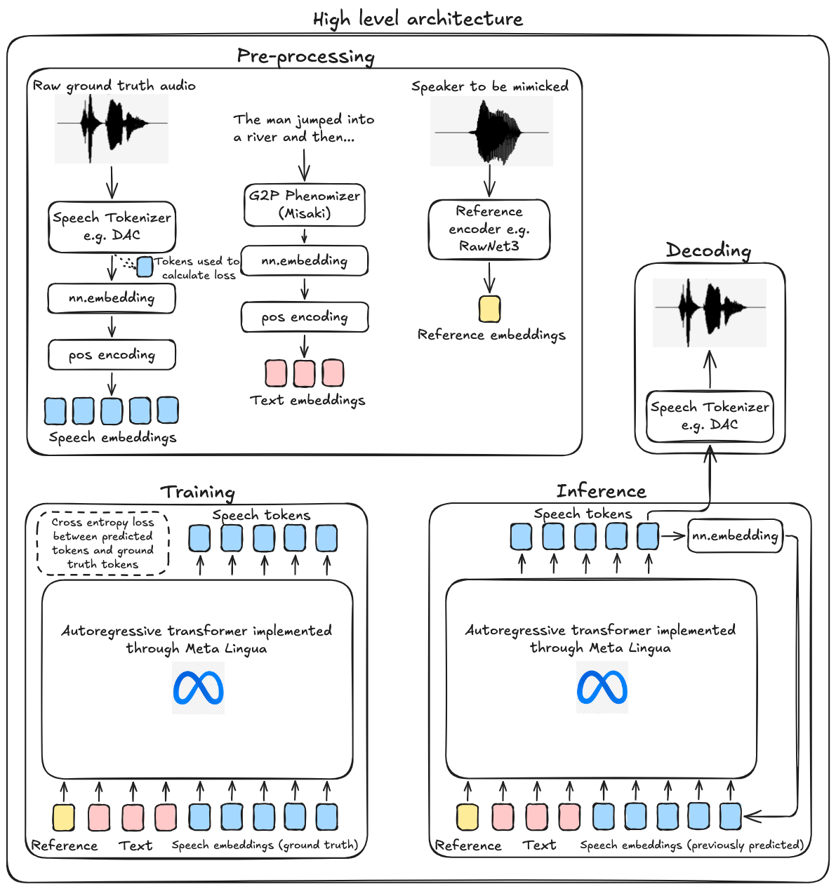

# AlexTTS
*Author: Alex Chen*

## Motivation
I wanted to understand, at a low level, what an end-to-end deep learning project **really** means. While I've had some experience with autoregressive text generation models, it was primarily limited to fine-tuning pre-existing architectures. I had the privilege of speaking with [Eli](https://www.linkedin.com/in/elipugh), an ML researcher at [Cartesia](https://cartesia.ai/). Our conversation left me with a single, compelling thought:

> Why not build my own unique text-to-speech model?

## Terminology
- Text to speech (TTS): convert words to human speech
- Autoregressive: generate one token at a time, conditioning each output on previously generated frames. Example: ChatGPT
- Grapheme-to-phoneme (G2P): conversion from text (graphemes) to pronunciation (phonemes)
- Speech tokenizer/codec: encode speech into compressed representations (tokens). Similar to text tokenizers but for speech instead. Output: sequence of discrete tokens
- Reference encoder: capture speaker-specific characteristic from speech samples. Output: speaker embedding 

## Architecture
TTS models are typically categorized into two types:
- Autoregressive (e.g. [BaseTTS](https://arxiv.org/pdf/2402.08093))
- Non-autoregressive (e.g. [StyleTTS 2](https://arxiv.org/pdf/2306.07691))

[Kokoro](https://huggingface.co/hexgrad/Kokoro-82M) is a non-autoregressive lightweight TTS model with 82 million parameters. It is based on [ISTFTNet](https://arxiv.org/pdf/2203.02395) and [StyleTTS2](https://arxiv.org/pdf/2306.07691), converting phonetic inputs into mel-spectrograms to synthesize speech in parallel. While it gives great results, it is non-streamable due to its non-autoregressive nature. My goal was to leverage its G2P library, [misaki](https://github.com/hexgrad/misaki), and generate audio tokens autoregressively. 

## Results

## TTS architecture

## Conclusion